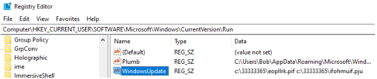

# Win32.Remcos.Loader / lab05.exe
27th June 2022

This is an analysis of `lab05.exe` from a Malware Analysis CTF run by @Bowflexin91 and @HBRH_314:  
https://cet.ctfd.io/cet.ctfd.io/readme

```
md5: a7983d32e7bd7228197e6dcf1c71ed66
sha1: 52f930dcce70cd3c6c4fcab5b9089d892fb20239
sha256: c8a4462c6b8f5d8728d5374adc98def5a5c38dd97d70a1c3859c876bfbe3fbd0
```

## Overview
lab05.exe is a self-extracting RAR archive that contains a compiled AutoIt script which is a loader for Remcos malware. lab05.exe extracts the AutoIt script, the AutoIt script unpacks and maps Remcos malware (here: https://breakingsecurity.net/remcos/) into RegSvcs.exe, and Remcos performs keylogging functionality and reports back to a C2.

### Network Indicators
Data sent back to C2 at:  
`shahzad73.casacam.net` / `192.210.78.136`.

### Host Indicators
#### Processes
If executing, eopllrk.pif will be running and have spawned a RegSvcs.exe subprocess.

#### Filesystem
RAR archive is extracted to `C:\33333365`  
Keylogged data is stored at `C:\Users\Bob\AppData\Roaming\remcos\logs.dat`  

#### Registry
Remcos installation is written to:  
`HKCU\Software\Remcos-7D9QA5` with keys `exepath` and `license`.

Persistence is installed as a Run key:  
```
HKCU\SOFTWARE\Microsoft\Windows\CurrentVersion\Run
WindowsUpdate: c:\33333365\eopllrk.pif c:\33333365\ifohmuif.pju
```

## Static Analysis of lab05.exe (initial .exe)
### PE
```
filetype: PE32
arch: I386
mode: 32
endianess: LE
type: GUI
  sfx: WinRAR(-)[-]
  compiler: EP:Microsoft Visual C/C++(2013-2017)[EXE32]
  compiler: Microsoft Visual C/C++(2015 v.14.0)[-]
  linker: Microsoft Linker(14.0, Visual Studio 2015 14.0*)[GUI32]
  overlay: RAR archive(-)[-]
  archive: RAR(5)[-]

TimeDateStamp    5E7C7DC7    Thu, 26 Mar 2020 10:02:47 UTC (823 days, 0.07 hours ago)    
```

```
λ trid lab05.exe
...
Collecting data from file: lab05.exe
 91.0% (.EXE) WinRAR Self Extracting archive (4.x-5.x) (265042/9/39)
```

The initial PE is a 32bit self-extracting RAR archive.  
The compile time suggests this isn't a new file (2020). 


.data looks compressed. A RawSize of 0x1200 is significantly smaller than a VirtualSize of 0x238b0. This fits with the PE being a compressed RAR archive.

### Strings
```
# PDB
D:\Projects\WinRAR\sfx\build\sfxrar32\Release\sfxrar.pdb

# Run key for persistence?
Software\Microsoft\Windows\CurrentVersion

# Lots of weird filename strings:
otnhrcj.txt
jwcksci.xls
dtgkwno.txt
nmsuehlk.pdf
ifohmuif.pju
eopllrk.pif
jhdkjdgehr.pdf
haucij.jpg
kqknrprtrg.dat
Setup=eopllrk.pif ifohmuif.pju
inxsqt.pdf
```

### PE Overlay
`pestudio` identifies there's an overlay.  
```
overlay (RAR) 
md5,A6E55CDA2AA76305F0CC2A4B0C972012 
sha1,3AE6AC7FA0D4F4B9F3677170FBCE7003908A48C6 
sha256,EAEB71EB354CED3DC8E6B7CF0C8CB3039CCE2050C7EFD5DD2F4D553CFB5825B2 
entropy,7.998 
file-offset,0x00043C00 
size,643278 (bytes) 
```

This overlay is the rar archive containing the files to extract.  
PEstudio says the file offset to the ovleray is at offset 0x00043C00, so extract it with HxD and save to disk.  
  
  

Unrar it to extract the rar contents.  
  

These filenames are the strings we saw earlier. There's a lot of junk here, but:  
- `eopllrk.pif` is a PE file 
- `ifohmuif.pju` looks to be encrypted and/or compressed data. 
- `kqknrptrg.dat` is potentially a key 

## Static Analysis of eopllrk.pif (initial .exe)
Now we're looking at the PE file extracted from the rar overlay above. Originally it's named `eopllrk.pif`. Rename it from a shortcut to .exe so that it's easier to work with:  
`λ mv eopllrk.pif eopllrk.exe`

### PE
```
md5: 3A662807345100A9670E710C8616D1B5
sha1: 0F3B3F0F0A877D9F1EE410AB0A52BCBE0B64356D
sha256: 78D69D13A0B072D4F89AD34F4EF07D84917585A5B1D921FB011D8F650FFB88D4

λ diec eopllrk.exe
filetype: PE32
arch: I386
mode: 32
endianess: LE
type: GUI
  compiler: Microsoft Visual C/C++(2010)[libcmt]
  linker: Microsoft Linker(10.0)[GUI32,signed]
  
TimeDateStamp    4F25BAEC    Sun, 29 Jan 2012 21:32:28 UTC (3802 days, 13.41 hours ago)    
```

#### Sections
.data looks to be compressed.  
A RawSize of 0x6800 is significantly smaller than a VirtualSize of 0x1A758.  
  

#### Imports
There's lot sof internet capabilities in this PE's imports:  
```
wsock32.dll
8000000D    8000000D    N/A    N/A    0000000D (listen)   
80000073    80000073    N/A    N/A    00000073 (WSAStartup)   
80000002    80000002    N/A    N/A    00000002 (bind)   
80000003    80000003    N/A    N/A    00000003 (closesocket)   
80000004    80000004    N/A    N/A    00000004 (connect)   
80000017    80000017    N/A    N/A    00000017 (socket)   
80000013    80000013    N/A    N/A    00000013 (send)   
80000001    80000001    N/A    N/A    00000001 (accept)   
80000010    80000010    N/A    N/A    00000010 (recv)   

wininet.dll
0008E08A    0008E08A    009F    InternetReadFile       
0008DFB4    0008DFB4    009A    InternetOpenW       
0008E018    0008E018    0072    InternetConnectW       
0008E02C    0008E02C    0058    HttpOpenRequestW       
0008E076    0008E076    0099    InternetOpenUrlW  

psapi.dll
0008E0C8    0008E0C8    0006    EnumProcesses        
````

#### Version Info
The original OriginalFilename is set to EXPLORER.EXE, potentially tyring to be covert and appear as a legitimate binary.


#### Strings
A few strings suggest this is an AutoIt script:  
```
AutoIt:
00083768    /AutoIt3OutputDebug   
00083790    /AutoIt3ExecuteLine   
000837B8    /AutoIt3ExecuteScript   
```

And these look like keylogger strings:  
```
000F294C    UNICODE    EXPLORER.EXE    
0008A2BB    UNICODE    KEYPRESSED    
00087F37    UNICODE    KEYSET   
000844C0    ALTUP   
000844CC    ALTDOWN   
000844DC    CTRLUP   
000844EC    CTRLDOWN   
00084500    MOUSE_XBUTTON2   
00084520    MOUSE_XBUTTON1   
00084540    MOUSE_MBUTTON   
0008455C    MOUSE_RBUTTON   
00084578    MOUSE_LBUTTON   
00084594    LAUNCH_APP2   
000845AC    LAUNCH_APP1   
000845C4    LAUNCH_MEDIA   
000845E0    LAUNCH_MAIL   
000845F8    MEDIA_PLAY_PAUSE   
0008461C    MEDIA_STOP   
00084634    MEDIA_PREV   
0008464C    MEDIA_NEXT   
00084664    VOLUME_UP   
00084678    VOLUME_DOWN   
00084690    VOLUME_MUTE   
000846A8    BROWSER_HOME   
000846C4    BROWSER_FAVORTIES   
000846E8    BROWSER_SEARCH   
00084708    BROWSER_STOP   
00084724    BROWSER_REFRESH   
00084744    BROWSER_FORWARD   
00084764    BROWSER_BACK   
00084780    NUMPADENTER   
00084798    SLEEP   
000847A4    RSHIFT   
000847B4    LSHIFT   
000847C4    RALT   
000847D0    LALT   
000847DC    RCTRL   
000847E8    LCTRL   
000847F4    APPSKEY   
00084804    NUMPADDIV   
00084818    NUMPADDOT   
0008482C    NUMPADSUB   
00084840    NUMPADADD   
00084854    NUMPADMULT   
0008486C    NUMPAD9   
0008487C    NUMPAD8   
0008488C    NUMPAD7   
0008489C    NUMPAD6   
000848AC    NUMPAD5   
000848BC    NUMPAD4   
000848CC    NUMPAD3   
000848DC    NUMPAD2   
000848EC    NUMPAD1   
000848FC    NUMPAD0   
0008490C    CAPSLOCK   
00084920    PAUSE   
0008492C    BREAK   
00084938    NUMLOCK   
00084948    SCROLLLOCK   
00084960    RWIN   
0008496C    LWIN   
00084978    PRINTSCREEN   
000849A0    SPACE   
000849AC    RIGHT   
000849B8    PGUP   
000849C4    PGDN   
000849D0    LEFT   
000849DC    INSERT   
000849F4    HOME   
00084A60    ESCAPE   
00084A78    ENTER   
00084A8C    DOWN   
00084A98    DELETE   
00084AB8    BACKSPACE   
```

## Dynamic Analysis of lab05.exe (initial .exe)
After running the initial .exe (`lab05.exe`) we can see `eopllrk.pif` and `RegSvcs.exe` executing.  
`eopllrk.pif` spawns `RegSvcs.exe`, and `RegSvcs.exe` contains the bulk of the logic and is connected to a listening server.


In Wireshark you'll see a for `shahzad73.casacam.net`, which is what `192.210.78.136` resolves to.  


`lab05.exe` extracts the contents of the .rar archive to `C:\33333365`.  


And via procmon we can see that `lab05.exe` spawns `eopllrk.pif` with the cmdline: `"C:\33333365\eopllrk.pif" ifohmuif.pju`.  


## Dynamic Analysis of eopllrk.pif
`eopllrik.pif` performs a bunch of reads on `ifohmuif.pju` and then drops an modified version of `kqknrprtrg.dat` to `C:\Users\Bob\temp\kqknrprtrg.dat`

  

  

Based on static analysis this looks like the Run key persistence that gets installed.  
  

`eopllrik.pif` installs persistence:  
  

  

Lastly it copies `RegSvcs.exe` to a local temp folder: `AppData\Local\Temp\RegSvcs.exe`, spawns it, and injects into it.  
  

  

## RegSvcs.exe
RegSvcs.exe appears to execute Remcos, a remote control software by BreakingSecurity.net. It's a malware RAT that the company is attempting to brand as legitimate software.

https://breakingsecurity.net/remcos/

  

It writes two keys to the registry: "exexpath" and "license".  
  

And it writes all of its keylogged inputs to `C:\Users\Bob\AppData\Roaming\remcos\logs.dat`.  
  

If you examine the memory of RegSvcs.exe you'll find a RWX section.  
This is the manually mapped remcos malware which you can dump for further analysis.  
  

