# Call of Duty: Black Ops 2 Anti-Cheat Analysis
31st August 2022

This is a reversal of Call of Duty Black Ops 2's anticheat. This analysis is done against FitGirl's repack of the game which offers offline multiplayer. Done to improve my reverse engineering.

To dump the game I suspended the process via Process Hacker, attached x32dbg, and dumped the game using Scylla.

Summary:  
- Grabs exports via a hash  
- Takes StretchBlt screenshot if windowed, DirectX screenshot if fullscreen  
- Loads a map asset `mp/store_header.img` and executes it (shellcode that searches for external overlays)  
- Hooks BaseThreadInitThunk to monitor new threads (flags thread if start address is LoadLibraryA, LoadLibraryW, DbgUiRemoteBreakin, or SetUnhandledExcpetionFilter. If none match, calls VirtualQuery against start address)

## Grab Exports via Hash
Find by searching for references to the DOS header: `4D 5A`. (Search > Sequence of bytes...)  
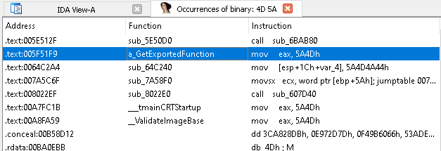

They get some function addresses by using a hash and walking the module's export table. This function is used repeatedly in anticheat functions meaning you can xref it to find more anticheat functionality.

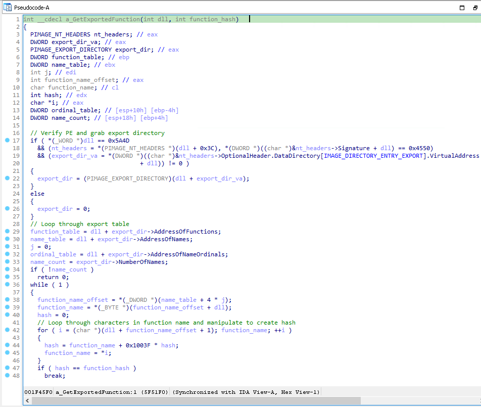

The hash routine for a module name and function name are different.

I took their hash technique from IDA and wrote a function so I could find what exports they're grabbing.

```c
#include <stdio.h>
#include <Windows.h>

int HashFunctionName(const char* string)
{
    int hash = 0;
    for (const char* str = string; *str != '\0'; str++)
    {
        char letter = *str;
        hash = letter + 0x1003F * hash;
    }
    return hash;
}

void FindHash(int hash)
{
    char modules[10][256] = 
    { 
        "ntdll.dll", 
        "kernel32.dll",
        "kernelbase.dll",
        "user32.dll", 
        "advapi32.dll", 
        "crypt32.dll", 
        "gdi32.dll", 
        "gdi32full.dll", 
        "shell32.dll",
        "shlwapi.dll"
    };

    for (int j = 0; j < ARRAYSIZE(modules); j++)
    {
        void* dll = (void*)LoadLibraryA(modules[j]);
        if (dll == NULL) {
            printf("- LoadLibraryA(%s) failed: %d \n", modules[j], GetLastError());
            continue;
        }

        PIMAGE_DOS_HEADER dos_header = (PIMAGE_DOS_HEADER)dll;
        PIMAGE_NT_HEADERS nt_header = (PIMAGE_NT_HEADERS)((size_t)dll + dos_header->e_lfanew);
        PIMAGE_EXPORT_DIRECTORY export_dir = (PIMAGE_EXPORT_DIRECTORY)((size_t)dll + nt_header->OptionalHeader.DataDirectory[IMAGE_DIRECTORY_ENTRY_EXPORT].VirtualAddress);

        DWORD* name_table = (DWORD*)((size_t)dll + export_dir->AddressOfNames);
        DWORD* address_table = (DWORD*)((size_t)dll + export_dir->AddressOfFunctions);
        WORD* ordinal_table = (WORD*)((size_t)dll + export_dir->AddressOfNameOrdinals);
        for (DWORD i = 0; i < export_dir->NumberOfNames; i++)
        {
            char* function_name = (char*)((size_t)dll + name_table[i]);
            size_t function_addr = (size_t)((size_t)dll + address_table[ordinal_table[i]]);

            int function_hash = HashFunctionName(function_name);
            if (function_hash == hash) {
                printf("0x%x : %s:%s \n", hash, modules[j], function_name);
                break;
            }
        }
    }

    return;
}

int main()
{
    FindHash(0x24CE57E5);    
    return 0;
}
```

## Screenshots
Found by xref'ing the BitBlt and StretchBlt imports.  
To find the DirectX screenshot look at the function that calls StretchBlt, the DirectX screenshot is called there.  
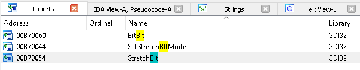

If the game is in windowed mode it will take a screenshot with StretchBlt.  
If in fullscreen, it takes a screenshot via DirectX screenshot (with CreateTexture2D and CopyResource).

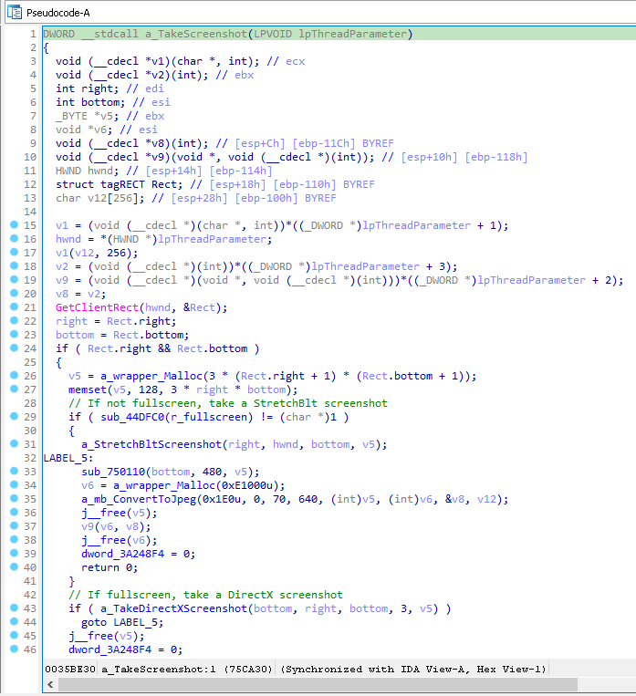

StretchBlt screenshot:  
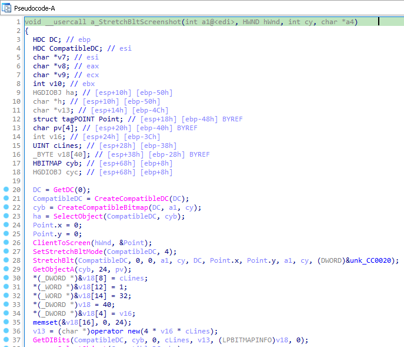  

DirectX screenshot:  
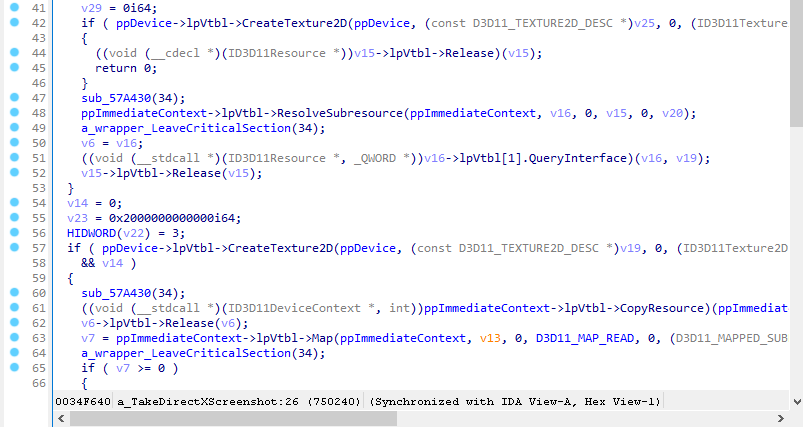

This function is actually started as a new thread and there seems to a global variable determining whether to take a screenshot or not.

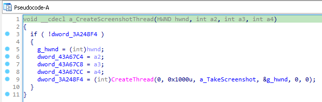

There's also a BitBlt call but I don't think it's related to anticheat. The functions around it seem to monitor performance.

## ExecuteMapAsset - Analyse External Overlays
This function was found by xref'ing `GetExportedFunction`.

It loads the map asset `mp/store_header.img`, searches the currently loaded modules for `kernel32.dll`, and allocates 0x2000 bytes of `PAGE_EXECUTE_READWRITE` memory. 

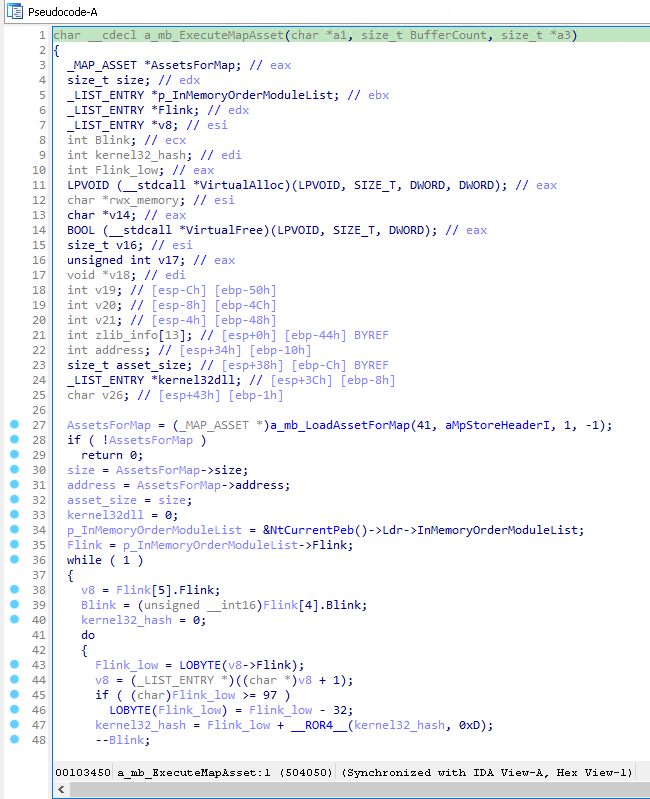

`LoadMapAsset` is used in many locations but this function (which loads a map asset and executes it) is only used once. This map asset must be special (or not a map asset at all).

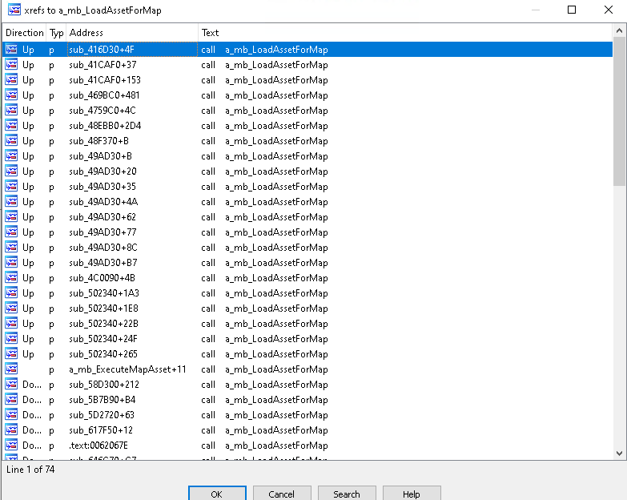

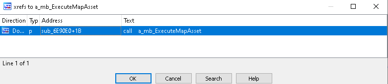

After allocating executable memory it decompresses the asset, does a few things I can't tell (they look like sprintf style functions to me) and then executes a function within the allocated RWX region  at +8.

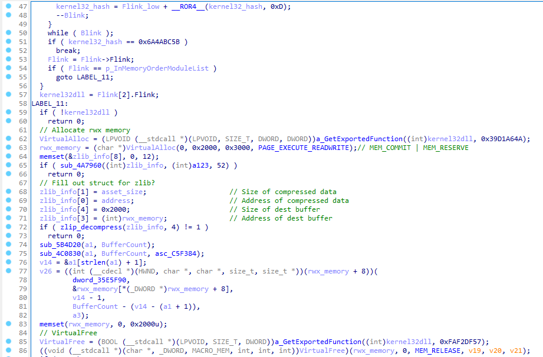

I made an educated guess about the `zlib_decompress` function being zlib because the function is full of strings which, when googled, refer to zlib.

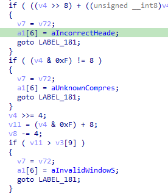

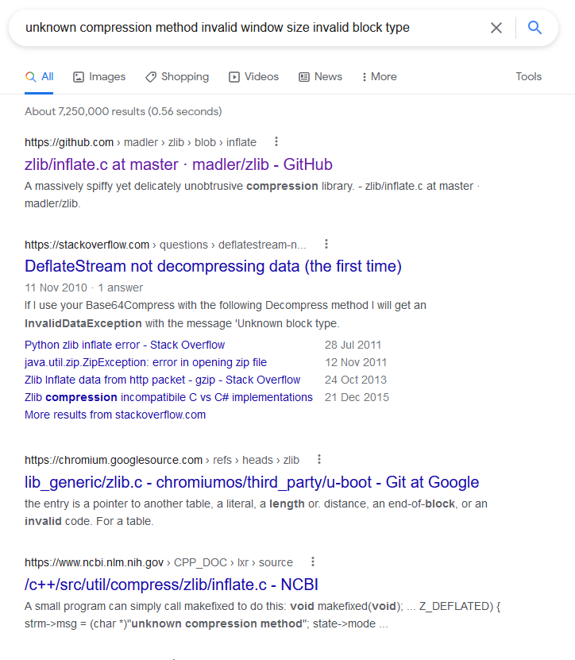

I can't find any reference to `mp/store_header.img` in the game's install directory so it must be embedded somewhere. There's no ASLR enabled for the game's binary, so to dump the shellcode I attached x32dbg and set a breakpoint where the shellcode gets called: `0x00504195 : call ecx;`.

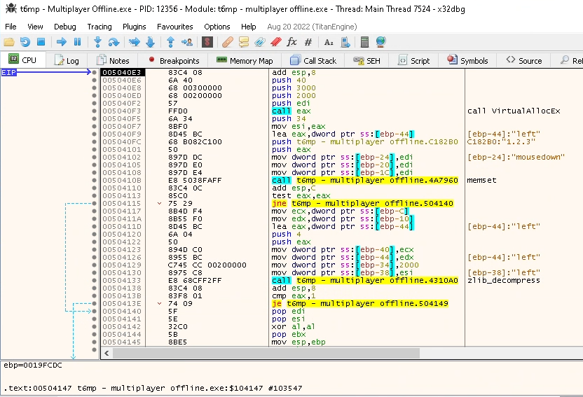  
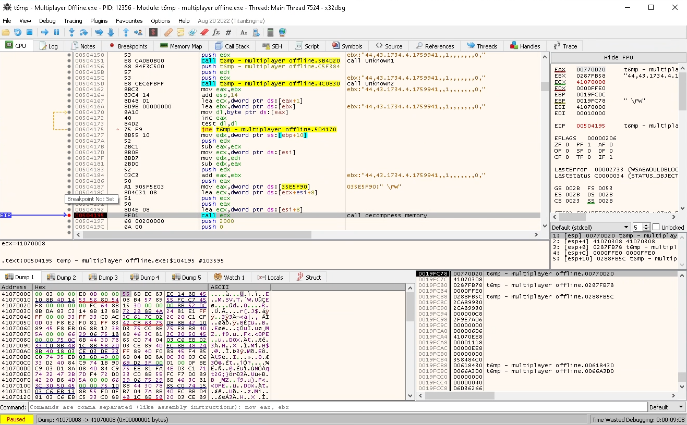
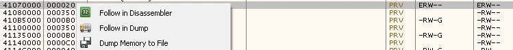

### Shellcode Analysis (EnumWindows)
The shellcode starts executing at +8. When the dump is loaded into IDA create a function at +8 by `right click > Create function` or press P (?). Here's mine:  
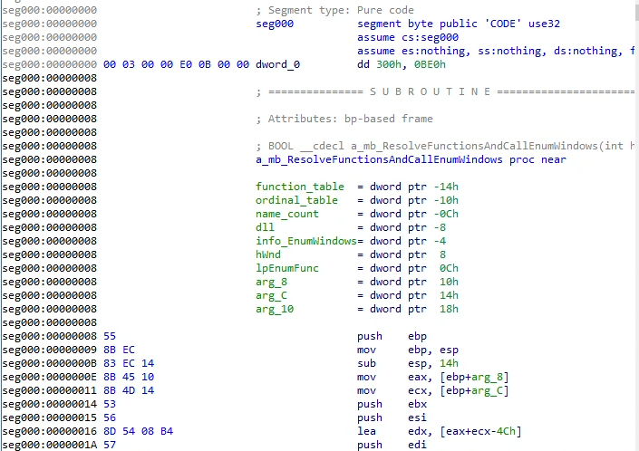

There's 2 functions in this shellcode: the 1st finds all the functions it needs (via the same `GetExportedFunction` method above), calculates the game's window size, and calls EnumWindows, and the 2nd function is the EnumWindowsCallback.

#### ResolveFunctions() - 1st Function
The functions it resolves are:  
- user32.dll: GetWindowTextA  
- user32.dll: GetWindowsLongA
- user32.dll: GetWindowRect (here it calls GetWindowRect to grab the game's window size)
- user32.dll: EnumWindows

Here's it resolving user32.dll.  
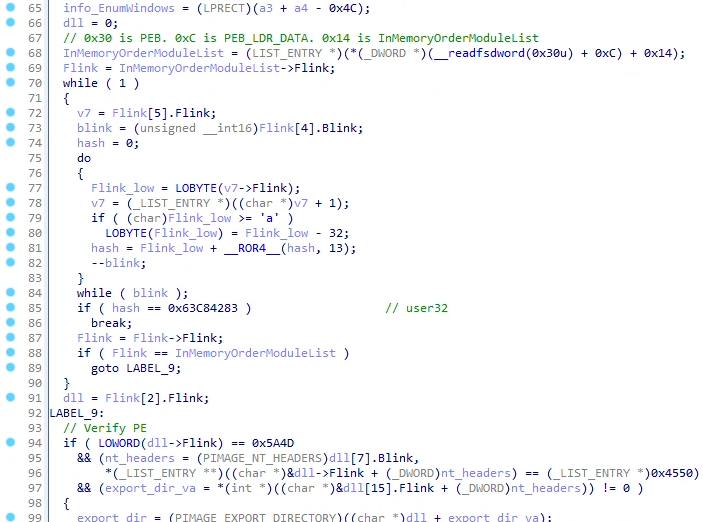

And here resolves and calls EnumWindows.  
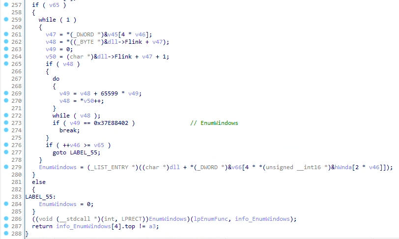

#### EnumWindows - 2nd Function
You'll have a to create another function at this callback (mines at 0x308).

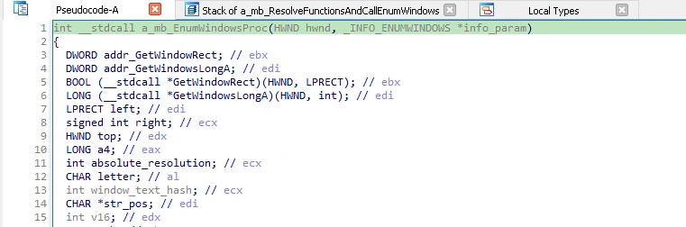

This function is fairly large and checks for external overlays. It's only interested in WS_EX_TOPMOST and WS_VISIBLE windows, and windows that are larger than or equal to the size of the game. If it finds a suitable window, the shellcode will: grab its window name, grab its window class name, `GetWindowThreadProcessId` and `OpenProcess` to open a handle to the associated process, grab the EXE name with `QueryFullProcessImageNameA`, and enumerate all modules in the suspicious process and grab the module names. It seems to store all this information in a struct that persists after the shellcode has been freed. It loops over all of the names it gathers but doesn't seem to do anything with them.

Only interested in WS_EX_TOPMOST and WS_VISIBLE windows, and windows that are larger than or equal to the size of the game:  
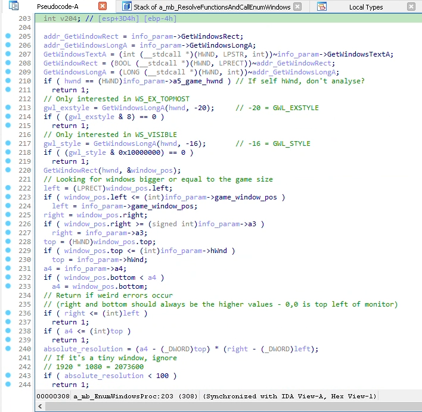

It grabs the window text and seems to check for specific window names.  
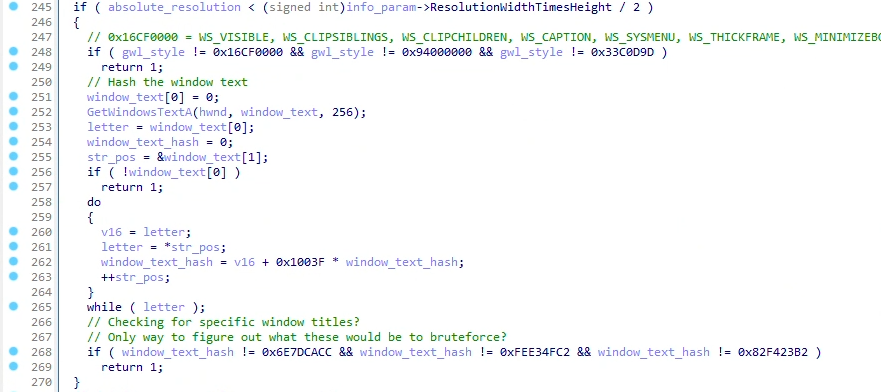

I can't really tell what this is doing. My best guess is that it's concatenating window class names stored in the persistent struct together with `-` and `,`.  
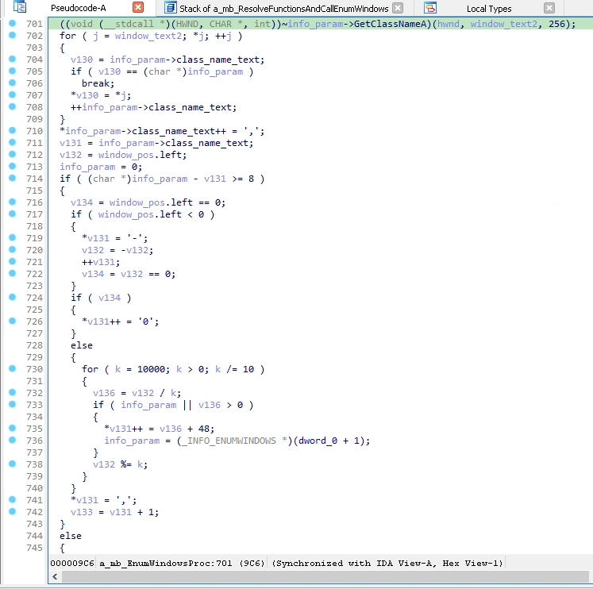

Here it's inspecting the window styles (don't really know what).  
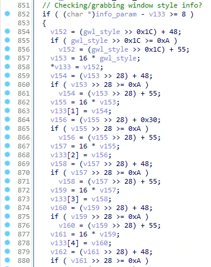

Lastly it opens the process and enumerates its modules.  
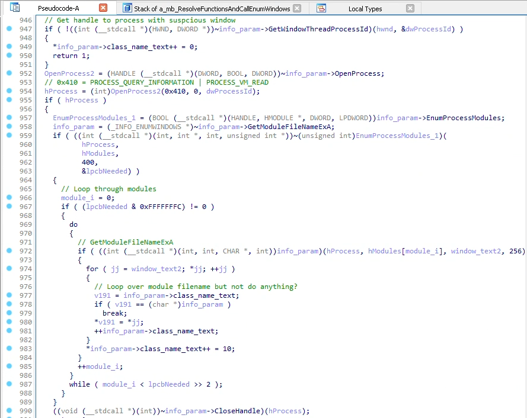

Here it grabs the process name too.  
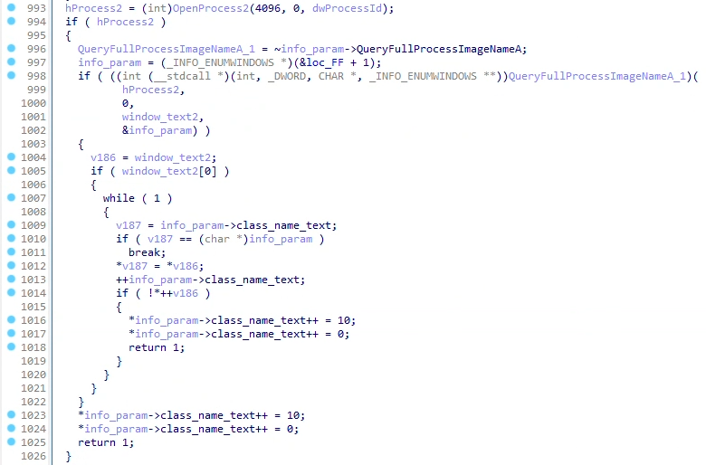

My best guess at the info struct where it stores all its results is this:  
```
struct _INFO_ENUMWINDOWS  
{  
  LPRECT game_window_pos;  
  HWND hWnd;  
  DWORD a3;  
  DWORD a4;  
  DWORD a5_game_hwnd;  
  DWORD ResolutionWidthTimesHeight;  
  DWORD GetWindowsRect;  
  DWORD GetWindowsLongA;  
  DWORD GetWindowsTextA;  
  DWORD GetClassNameA;  
  DWORD GetWindowThreadProcessId;  
  DWORD OpenProcess;  
  DWORD EnumProcessModules;  
  DWORD GetModuleFileNameExA;  
  DWORD QueryFullProcessImageNameA;  
  DWORD CloseHandle;  
  char *window_text;  
  char *class_name_text;  
};
```

But I actually think that `class_name_text` at the end is another structure which stores window_text, class_name_text, the process name, module names, window resolution and style, etc.

## BaseThreadInitThunk Hook to Monitor New Threads
Found by xref'ing `GetExportedFunction`.

Within WinMain, mixed together will all the other initialisation functions, there's a hook for BaseThreadInitThunk that gets installed.

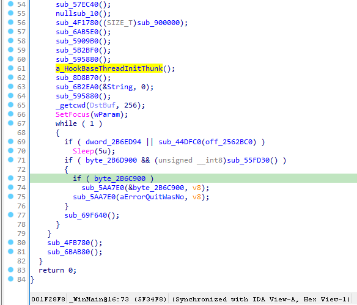

It grabs BaseThreadInitThunk from kernel32, verifies the bytes at the function, grabs VirtualProtect and FlushInstructionCache, and installs a hook.

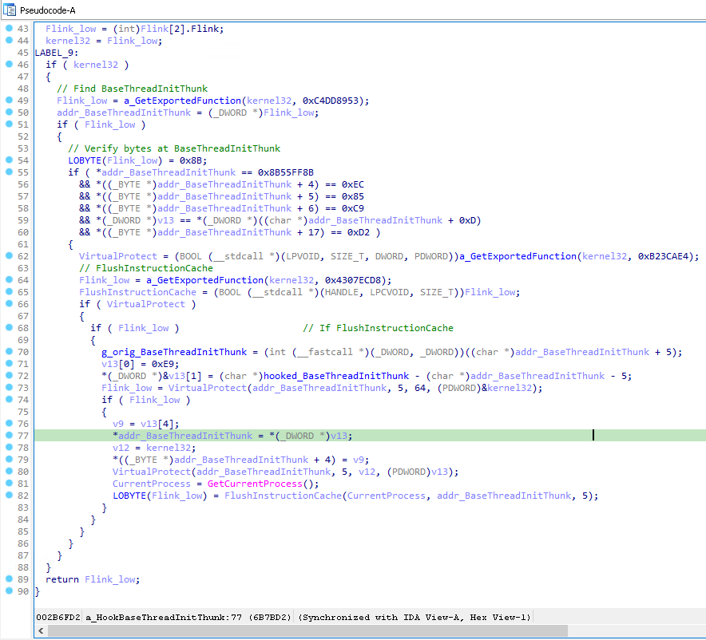

On Windows 10 I'm fairly sure this hook won't get installed because the function bytes for BaseThreadInitThunk in the 32bit kernel32.dll are different from ones they're verifying. The first 5 bytes are a match - `8B FF 55 8B EC` - but from there it differs.

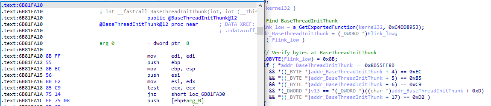

The detour function inspects the start address and parameter of the new thread.  
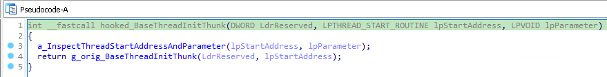  

It checks if the start address of the thread is LoadLibraryA or LoadLibraryW.  
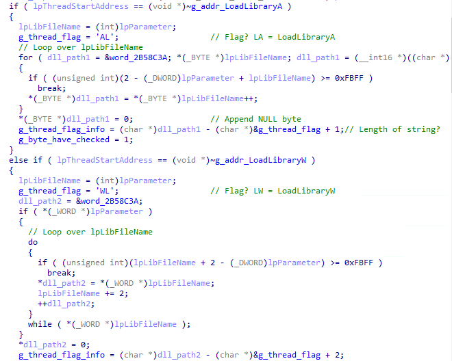

If the start address is DbgUiRemoteBreakin (check if you're attaching a debugger).  
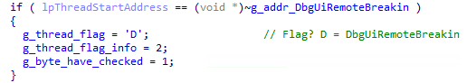

If the start address is SetUnhandledExceptionFilter.  
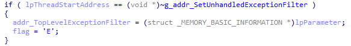

If none of those match, it calls VirtualQuery against the thread's start address and copies the memory to a global region. I can't tell what it does after that or how it analyses it etc.  
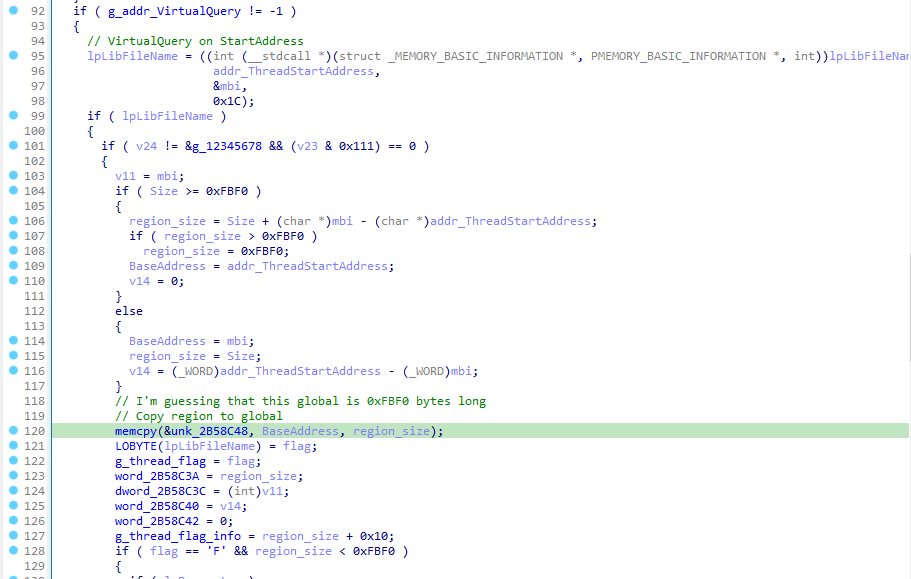  
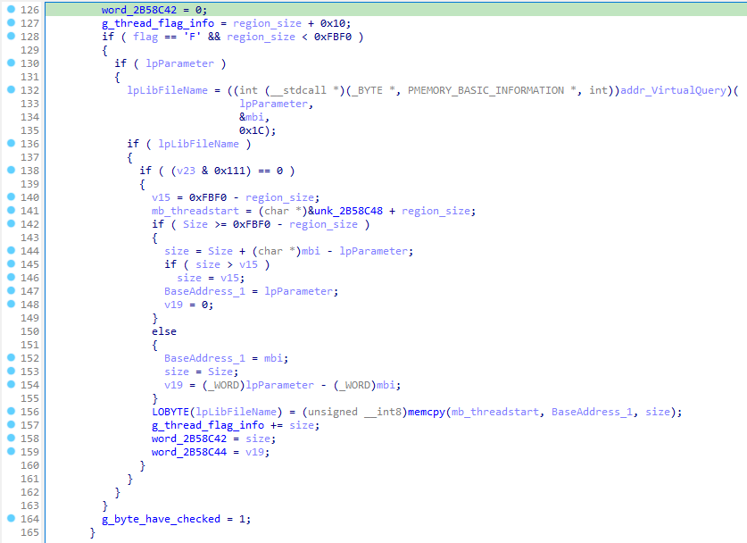


## Bonus Unknowns
This is all bonus unknown stuff that I found that looks potentially interesting but that I can't figure out.

### Find Region, Add VEH, and Inspect DR3
When searching for VirtualQuery uses I found this:  
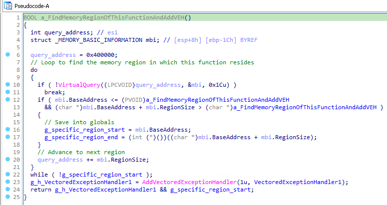

It searches for the memory region in which this function resides, saves the region's start and end address to a global, and then installs a Vectored Exception Handler (VEH). This VEH is only interested in the exception if it's:  
- within the previously saved region  
- is not a SINGLE_STEP  
- a hardware breakpoint isn't enabled (for DR3 I'm guessing, haven't tested ANDing 0x40)

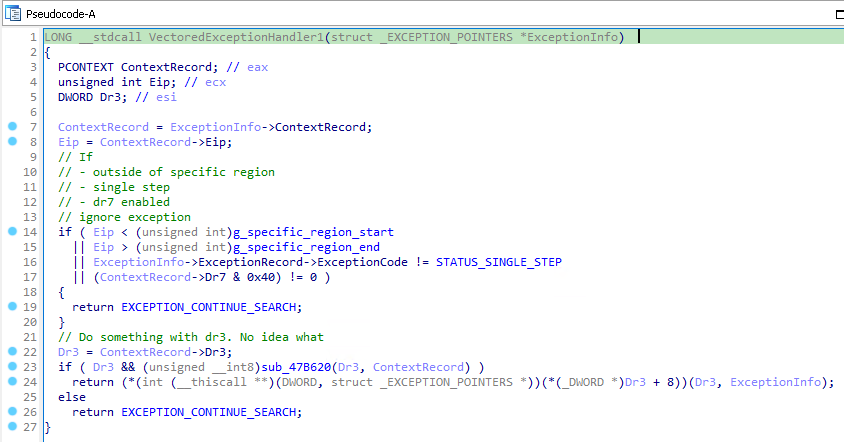

The subroutine saves the current thread ID and the DR registers and other stuff I can't figure out statically.

### Decompress and Execute Memory
This function is very similar to `ExecuteMapAsset` except it executes a specific region of memory instead of loading an asset.

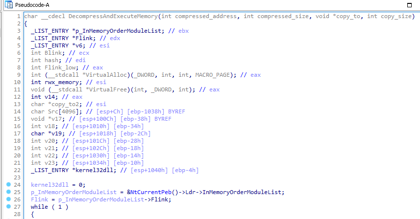

It grabs kernel32.dll from the InMemoryOrderModuleList, grabs VirtualAlloc, and allocates 0x2000 bytes of PAGE_EXECUTE_READWRITE memory. It then decompresses the memory and executes it at +4. I attached a debugger and sat in a bot match for a couple of hours waiting for this to execute but it never did, so not sure what to do here :shrug:.  
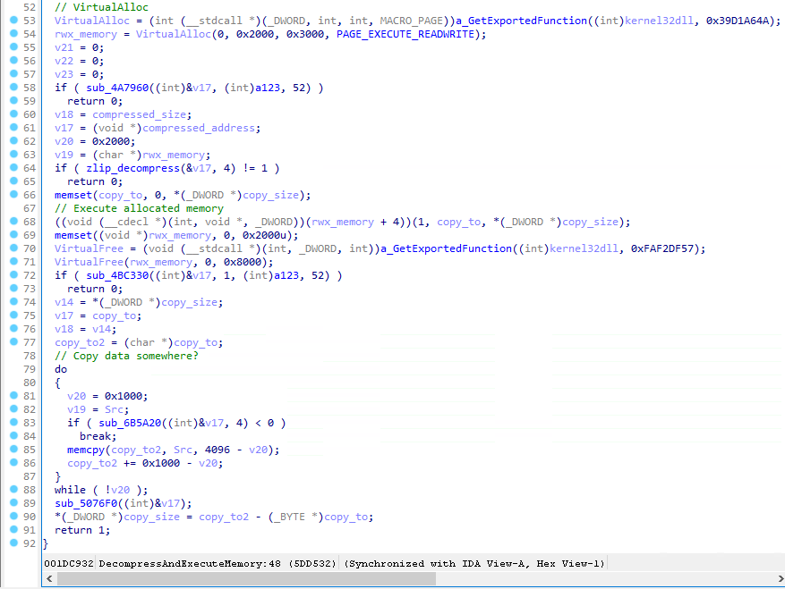

 
### CreateThread RaiseException
There's a bunch of calls to CreateThread followed by a raise exception which executes "Worker" functions. Here's 1 example.

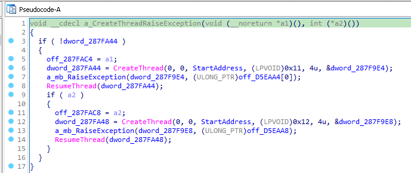

The thread start address raises an exception at an address in a table determined by the `lpThreadParameter`, from `Main` to `WebM http work thread`, which then raises another exception.  
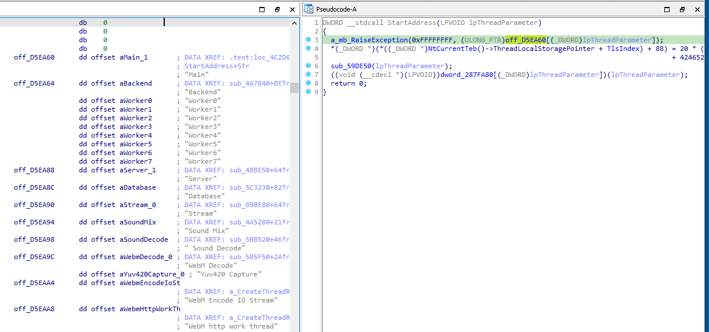

I haven't found the exception handler that manages what this code does but I don't think it's anticheat related. Looks to be performance measuring or error checking stuff. I have no idea though.
