# Analysis of Skengdoo/be-eac-injector
6th August 2022

Everyone is after a public, undetected kernel injector within the game hacking scene at the moment. This project is available on github and promises a lot: works for every game, undetected, and EAC and BattlEye emulation.  
https://github.com/Skengdoo/be-eac-injector

This seems like an overpromise to me and highly suspicious so I decided to reverse it for malware. The injector works but it's certainly not undetected and there's definitely no anticheat emulation. There has since been an errata on the README from when I started reversing stating that the anticheat emulation isn't available in the public release.

## Summary
It's not malicious. The compiled `injector.exe` contains an embedded exe which it drops to disk, executes, and then deletes. The dropped .exe contains two embedded Windows `.sys` drivers: Intel's `iqvw64e.sys` driver which can be exploited for kernel read/write from userland (https://www.exploit-db.com/exploits/36392) and a custom driver (named `\\\\.\\PUSSY` by the developer). The dropped .exe exploits the intel driver to map the custom `PUSSY` driver. This functionality is exactly how `kdmapper` works: https://github.com/TheCruZ/kdmapper. With the custom driver mapped, the original `injector.exe` writes your DLL to inject into the target process along with some shellcode to call the Dll's entry point, and executes the shellcode in the target process from userland via SetWindowsHookEx.

## injector.exe
This is the initial file you execute.

It starts with a fake "loading" prompt and then loads the driver (via the embedded .exe). 
  
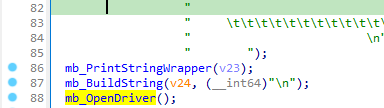  

### OpenDriver
There's lots of stack strings all over the place but they don't do anything for obfuscating the text. I imagine it's a mistake by the developer when implementing the obfuscation, I can't tell.  
  

Here it writes the embedded .exe to disk at `C:\Windows\SoftwareDistribution\Download`, executes it, and deletes it.  
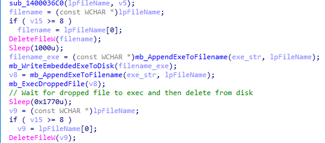  
  

`sub_1400036C0` builds the filepath:  
  

Execution is performed using `runas` with ShellExecuteW.  
  

After the embedded .exe has run (and loaded the intel driver and custom driver) it opens a handle to the custom driver.  
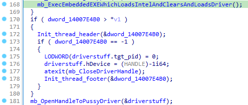  

## Embedded .exe
Now we're looking at the embedded .exe which loads the intel driver and the developer's custom driver.  
  

It writes the embedded Intel iqvw64e.sys driver to disk at `C:\Users\username\AppData\Local\Temp` with a random name (I think) and then loads it via NtLoadDriver and opens a handle to it.  
  

To load via NtLoadDriver it needs to create a registry entry for the driver at `SYSTEM\\CurrentControlSet\Services` with an `ImagePath` and `Type` value.  
  
  

At this point the intel driver is loaded.

It then grabs the base address of the currently loaded `ntoskrnl.exe` via `NtQuerySystemInformation` for use in pattern scanning later.  
  

  

And proceeds to clear traces of the intel driver having been loaded and then delete the dropped driver from disk. The functions that clear traces are basically the exact same as how `kdmapper` does it.  
  

- `ClearPiDDBCacheTable` - https://github.com/TheCruZ/kdmapper/blob/3a21e3a5a8955633d6b8fb159ae605420e44802e/kdmapper/intel_driver.cpp#L618
- `ClearKernelHashBucketList` - https://github.com/TheCruZ/kdmapper/blob/3a21e3a5a8955633d6b8fb159ae605420e44802e/kdmapper/intel_driver.cpp#L769
- `ClearMmUnloadedDrivers` - https://github.com/TheCruZ/kdmapper/blob/3a21e3a5a8955633d6b8fb159ae605420e44802e/kdmapper/intel_driver.cpp#L437

These are the patterns it uses
- for grabbing PiDDBCacheTable: `66 03 D2 48 8D 0D` + 0x06
- for grabbing PiDDBLock: `81 FB 6C 03 00 C0 0F 84 ?? ?? ?? ?? 48 8D 0D` + 0x0F

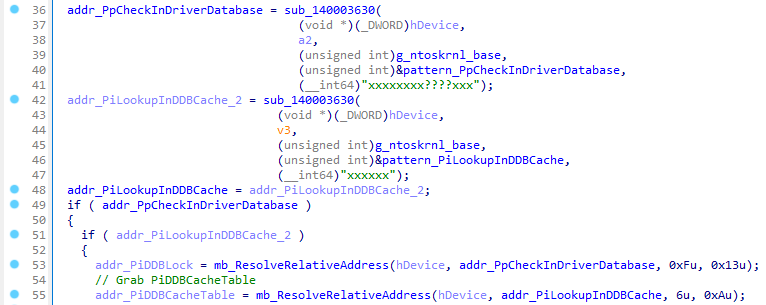  

Lastly it exploits the intel driver to call ExAllocatePoolWithTag and allocate memory in the kernel for the custom driver (verifies the DOS header etc.).  
  

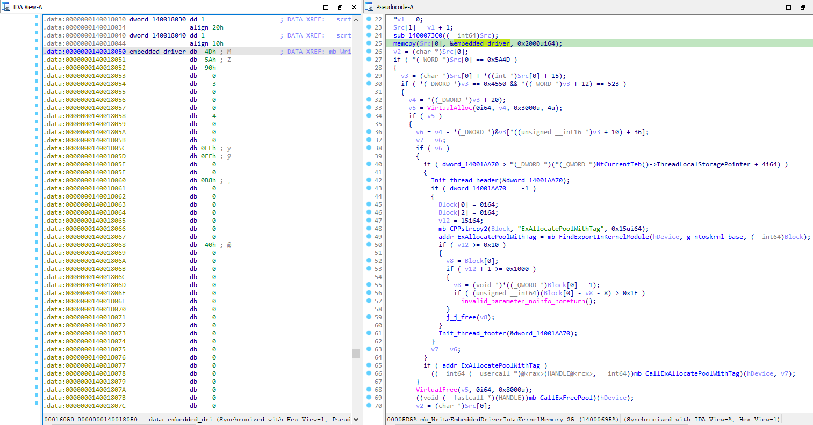  

## Custom Driver
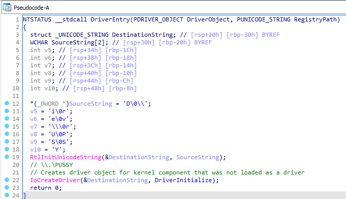  

This driver implements 4 functions: allocate memory, free memory, protect memory (change page protections), and read/write to memory.

It creates a driver object and symbolic name: `\\\\.\\PUSSY` and `\\DosDevices\\Pussy`.  
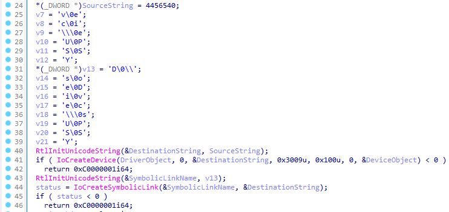  

Here's the major functions. Everything is inside `IRP_MJ_DEVICE_CONTROL`.  
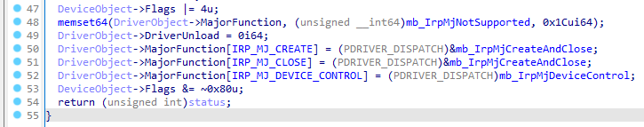  

### `IRP_MJ_DEVICE_CONTROL`
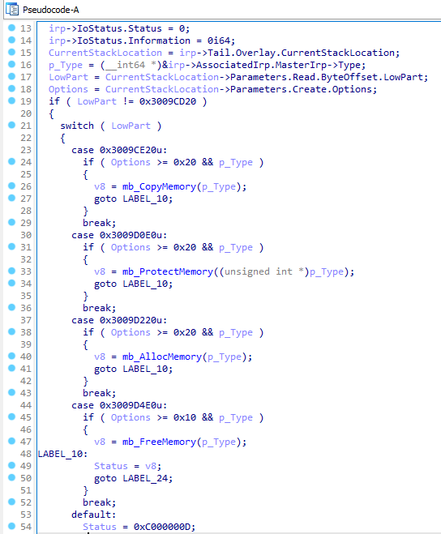  

- Case `0x3009CE20` is read/write to memory (with standard `MmCopyVirtualMemory`)
- Case `0x3009D0E0` changes memory protection (`KeAttachProcess` and `ZwProtectVirtualMemory`)
- Case `0x3009D220` allocates memory (`KeAttachProcess` and `ZwAllocateVirtualMemory`)
- Case `0x3009D4E0` frees memory (`KeAttachProcess` and `ZwFreeVirtualMemory`)

## injector.exe - InjectDLL
Now that the custom driver has been loaded by exploiting the Intel driver we're back to the original `injector.exe`. All that's left for the injector to do is write the DLL into the target process and execute it.

  

It finds the process to inject into via the window class name (taken from user input):  
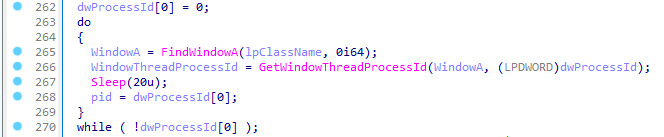  

Instead of emulating the anticheat in any way it prints a fake log implying that it has. Presumably the developer has removed this functionality.  
  
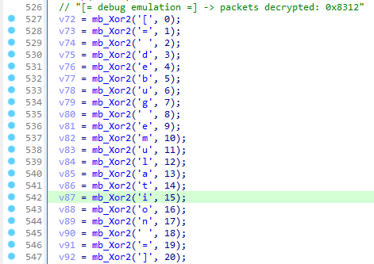  

It allocates memory for the driver in the target process, performs base relocations, and resolves imports.  
  

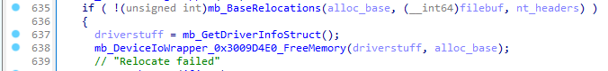  

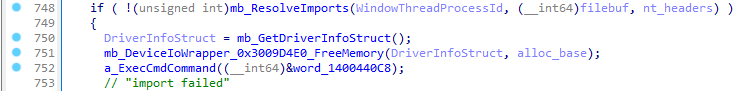  

Maps the DLL section's (interestingly it doesn't write the DLL's PE header).  
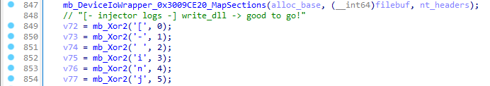  

And calls the DLL.  
  

### CallDllMain
Here it builds the shellcode to call the DLL's entry point (remember that `0x3009D220` allocates memory and `0x3009CE20` writes memory).  
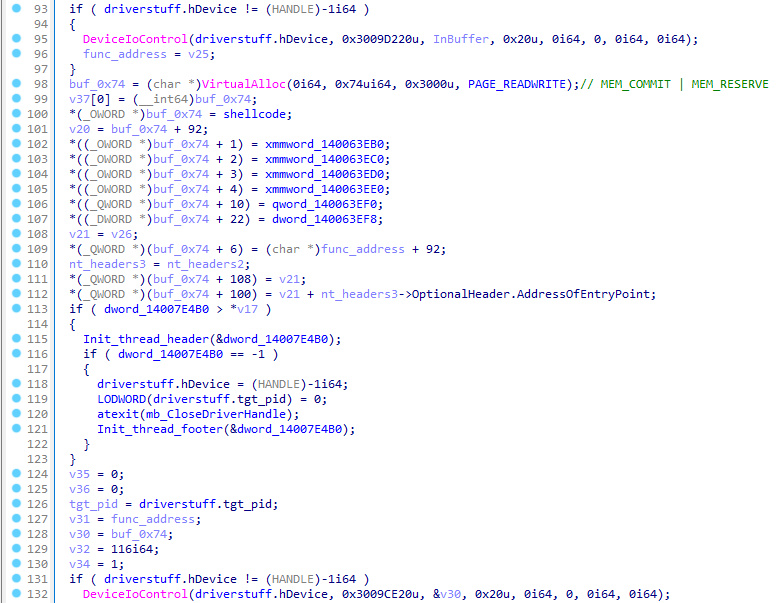  

It then calls the shellcode in the target process via `SetWindowsHookEx` and `PostThreadMessageA` with `WM_NULL`, removes the hook, and frees the shellcode afterwards.  
  

Here's a copy of the shellcode after it's been built. It simply calls the Dll's entry point.
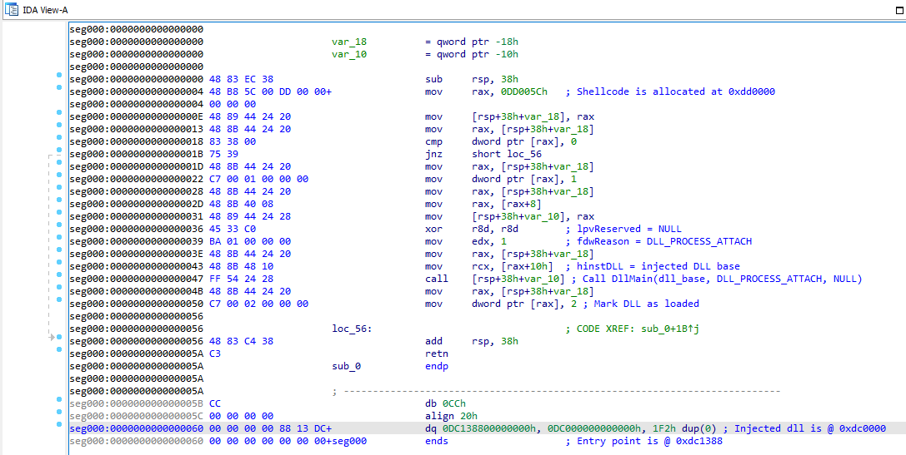  

## Conclusion
It's `kdmapper` with a custom driver to read, write, and allocate memory and uses SetWindowsHookEx to execute shellcode in the target process which calls DllMain. It's a bog standard DLL injector. There's no anticheat emulation. Without the anitcheat emulation the injected DLL will be detected (it's a RWX region not backed by a loaded, signed module). If there really is anticheat emulation then how you map the DLL doesn't matter because the anticheat won't be doing anything. It's not malicious but without the anticheat emulation it's not a useful kernel injector either.